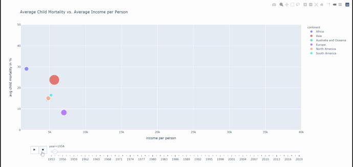

# Gapminder-Data-Vizualisation

## Introduction

The purpose of the project is to visualize the change in average child mortality per continent by increased average income per person and continent. 

## Project Structure

#### 1. EDA

- Pandas is used for explorative data analysis and data wrangling 
- Data provided by the gapminder foundation is used 

#### 2. Visualization and animation

- To create an animation plotly_express scatterplot is used  

#### 3. Export Animation as html
- For exporting the animation as a html file plotly.io is used

## General Usage

1. Clone the Git repository: `git clone `
2. Install the requirements: `pip install requirements.txt`

## License

Distributed under the MIT License. See `LICENSE` for more Information.
